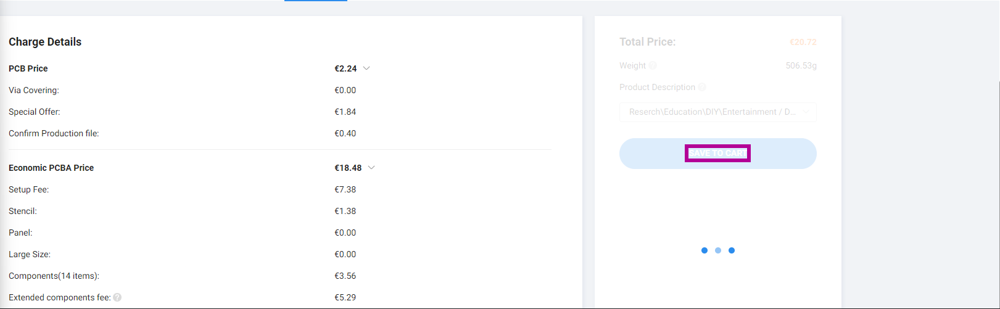

# Buy the potentiometer

You'll need to buy 4 pots model `PTA45432015CPB503` from where you want since it's not available on JLCPCB.

# How to order on JLC PCB

## Step 1: Upload Gerber Files

Go to [JLCPCB](https://jlcpcb.com/), and upload the zip file containing the gerber. 

## Step 2: Check the PCB

Select the "Confirm production file" just to be sure, it will only cost you a few cents.

> You can choose the PCB Color if you want

## Step 3: Select Assembly Service

Scroll and check the Assembly service

## Step 4: Select only 2 PCB Assembly (Minimum)

## Step 5: Confirm part placement

## Step 6: Validate PCBA setup

## Step 7: Check if there is anything wrong with the PCB view

## Step 8: Add the BOM

Add the BOM from the release page, it's called bom.csv

## Step 9: Add the component placement

Add the component placement file from the release page, it's called placement.csv (Same as CPL)

## Step 10: Confirm the components

## Step 11: Check if there is issues with the components and click next

## Step 12: The the produt descript as DIY (not important but you have to chose something)

## Step 13: Save to cart

