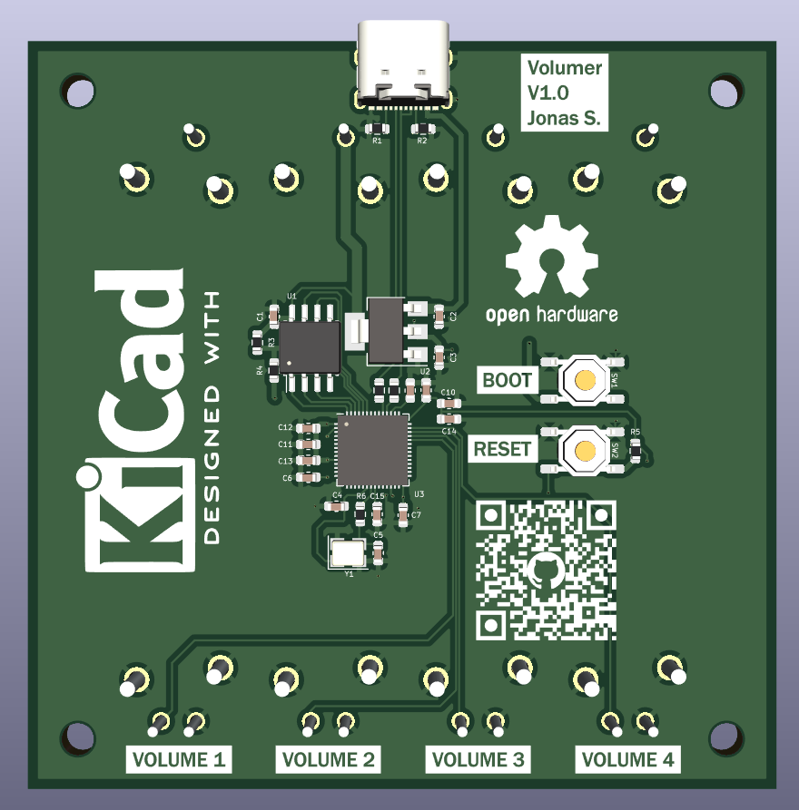

## PCB

### V1.0
[V1.0](./pcb/volumer_v1.0/)

[V1.0 Schematics](./pcb/volumer_v1.0/volumer_v1.0.pdf)

Version 1.0 should be the final version:
- Now has Mounting Holes
- Only 2 extended parts (JLCPCB)
- Only 2 layers
- Smaller board but same gap between sliders
- Need enclosure

### V0.2
[V0.2](./pcb/volumer_v0.2/)

[V0.2 Schematics](./pcb/volumer_v0.2/volumer_v02.pdf)

Version 0.2 is the first version that is actually usable:
- ERROR with the buttons (caused by 2 pins button in schematics but 4 pins footprint)
- Linear pots are nice and satisfying
- Size of pots is good
- Place between pots is good
- LEDs are useless
- PCB could be a lot smaller (pots mounted on other side of PCB)
- Broken QR code, freak this random qr code website, use [https://github.com/lyqht/styled-qr-code-generator](https://github.com/lyqht/styled-qr-code-generator)

### V0.1
[V0.1 folder](./pcb/volumer_v0.1/)

[V0.1 Schematics](./pcb/volumer_v0.1/volumer.pdf)

Version 0.1 was a prototype 
- Rotary encoders are not really satisfying to turn
- you can only turn one at the time
- Wrong rotary choice (really hard to turn and not clicky)
- Encoders too close to each other, cant pass a finger between them