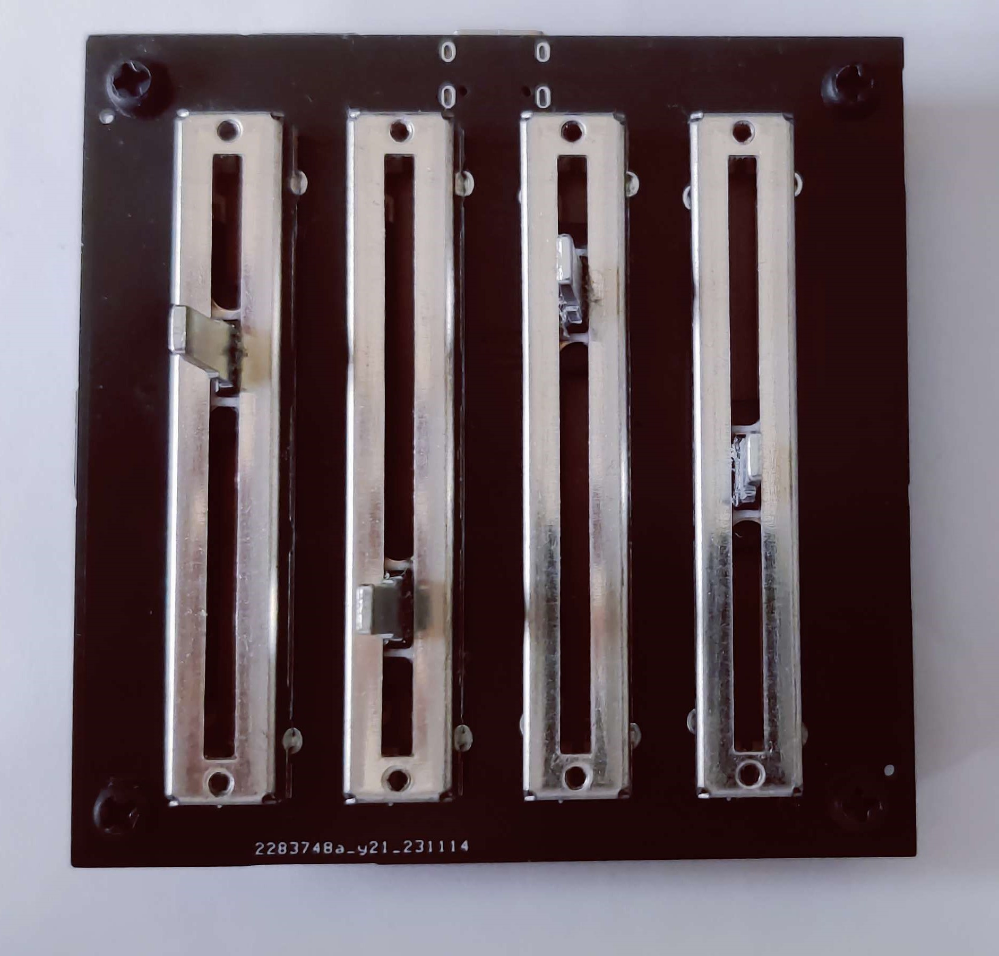
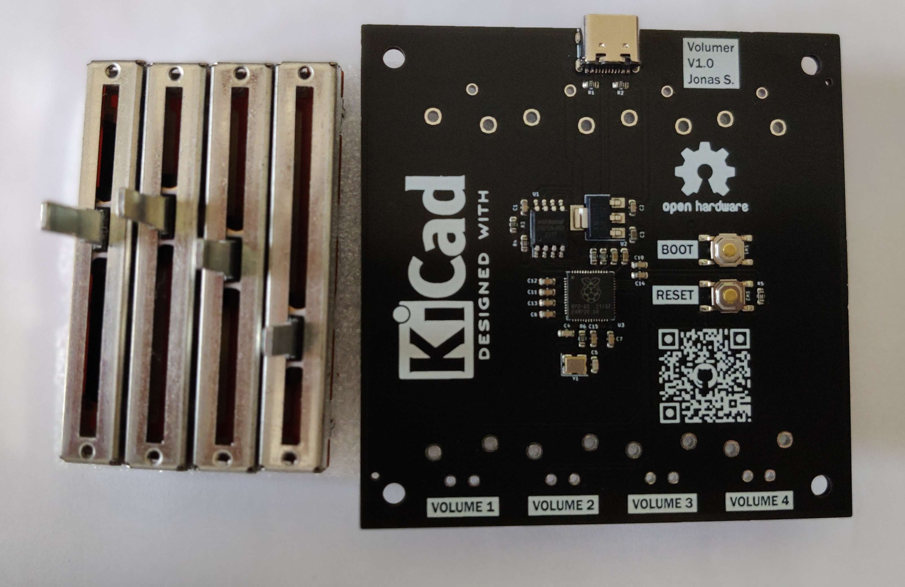

# Volumer
Hardware module to easily control Individual Windows app just like the volume Mixer.


Accessing this window is a pain, especially if you're in game and you need to quickly lower that annoying SCREAMING discord friend in order to hear some terrorist footsteps.







> The PCB parts have been chosen for cheapest PCB Assembly with only 2 JLC PCB extended parts 


## How to setup
First you have to order your PCB and mount the potentiometers:
- [PCB Information](pcbs.md)
- [JLC PCB Order instructions](jlc_order.md)


Then you can install the software on the PC and flash the firmware on the Board:
- [Install the PC app](#pc-software)
- [Install/Update Board Firmware](#board-firmware)


## PC Software

[https://github.com/omriharel/deej](https://github.com/omriharel/deej)


For simplicity and not to reinvent the wheel, I'm using an opensource project called DEEJ, which actually does exactly what I want to do.

You only need to put the executable in the same folder as the config file and make a shortcut to the executable in the startup folder to have it start with windows.

config : [./src/pc/config.yaml](./src/pc/config.yaml) 

In the config, You can set which potentiometer controls which application and set the COM port of the board (The COM port is not automatically detected).


## Board Firmware 
You Circuit python or a UF2 compiled C program are available in the release page.


### C firmware
There is an already compiled UF2 file in the releases.

You can also compile the code yourself (need the RPI PICO SDK) and flash it to the board (Drag'n'drop in BOOTSEL mode). 

Compile with:
```bash
cd src/board/c
mkdir build
cd build
cmake ..
make
```

You can then flash the board with the generated UF2 file in the bin folder.

### Circuit Python
You can also use Circuitpython, which for a firmware that simple, i would not recommend it since it's just less reliable and efficient.

You'll first need to install Circuitpython firmware in the board and then push the program into it (Firmware and program available in release). 

To install the circuitpython firmware, you can simply drag and drop the UF2 file on the board after a boot with the BOOTSEL button pressed.

When Circuitpython is running, you can drag and drop the code.py file into the board Circuitpython mass storage (Not the one when bootsel is pressed).

## Download repo
Since there are submodules, you need to clone with the --recurse-submodules flag:


```bash
git clone --recurse-submodules
```

If you cloned without submodules
```bash
git submodule update --init
```