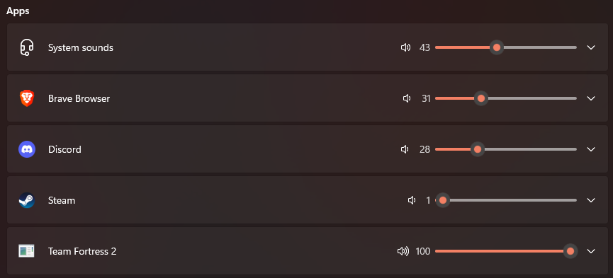

# Volumer
Hardware module to easily control Individual Windows app just like the volume Mixer.





Accessing this window is a pain, especially if you're in game and you need to quickly lower that annoying SCREAMING discord friend in order to hear some terrorist footsteps.


## TLDR
- [Install the PC app](#pc-software)
- [Install/Update Board Firmware](#board-firmware)
- [PCB Information](#pcb)


## PC Software

[https://github.com/omriharel/deej](https://github.com/omriharel/deej)


For simplicity and not to reinvent the wheel, I'm using an opensource project called DEEJ, which actually does exactly what I want to do.

You only need to put the executable in the same folder as the config file and make a shortcut to the executable in the startup folder to have it start with windows.


config : [./src/pc/config.yaml](./src/pc/config.yaml) 


In the config, You can set which pot controls which application and set the COM port of the board (Not automatically detected).


## Board Firmware 
You can use Circuit python or a UF2 compiled C program.


### Circuit Python
You'll first need to install Circuitpython, there's an UF2 file in the [bin folder](./bin/).


You can simply drag and drop the UF2 file on the board after a boot with the BOOTSEL button pressed.


When Circuitpython is running, you can simply drag and drop the [code.py](./src/board/cpy/code.py) file into the board Circuitpython mass storage (Not the one when bootsel is pressed).


### C
There is an already compiled UF2 file in the [bin folder](./bin/).


You can also compile the code yourself (need the RPI PICO SDK) and flash it to the board (Drag'n'drop in BOOTSEL mode). 

Compile with:
```bash
cd src/board/c
mkdir build
cd build
cmake ..
make
```

You can then flash the board with the generated UF2 file in the bin folder.


## Download repo
```bash
git clone --recurse-submodules
```

If you cloned without submodules
```bash
git submodule update --init
```