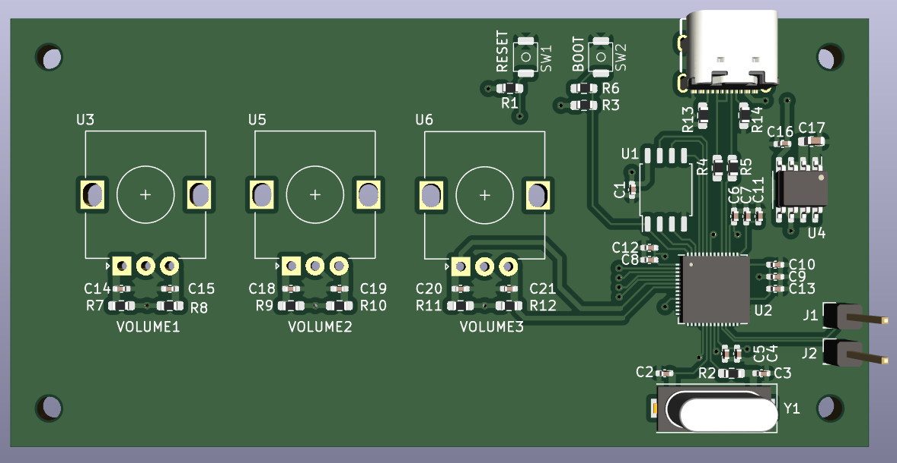

# Volumer
Volume Mixer Hardware module for easy access to individual application-wise volume control. 

## PCB

### V0.1
[V0.1 folder](./pcb/volumer_v0.1/)

[V0.1 Schematics](./pcb/volumer_v0.1/volumer.pdf)





Version 0.1 was a prototype 
- Rotary encoders are not really satisfying to turn
- you can only turn one at the time
- Wrong rotary choice (really hard to turn and not clicky)
- Encoders too close to each other, cant pass a finger between them

### V0.2
[V0.2](./pcb/volumer_v0.2/)

[V0.2 Schematics](./pcb/volumer_v0.2/volumer_v02.pdf)


Version 0.2 is the first version that is actually usable:
- ERROR with the buttons (caused by 2 pins button in schematics but 4 pins footprint)
- Linear pots are nice and satisfying
- Size of pots is good
- Place between pots is good
- LEDs are useless
- PCB could be a lot smaller (pots mounted on other side of PCB)

## PC Software

[https://github.com/omriharel/deej](https://github.com/omriharel/deej)


For simplicity and not to reinvent the wheel, I'm using an opensource project called DEEJ, which actually does exactly what I want to do.

You only need to put the executable in the same folder as the config file and make a shortcut to the executable in the startup folder to have it start with windows.


config : [deej_config.json](./src/pc/deej_config.json) 


In the config, You can set which pot controls which application and set the COM port of the board (Not automatically detected).


## Board Firmware 
You can use Circuit python or a UF2 compiled C program.


### Circuit Python
You'll first need to install Circuitpython, there's an UF2 file in the [bin folder](./bin/).


You can simply drag and drop the UF2 file on the board after a boot with the BOOTSEL button pressed.


When Circuitpython is running, you can simply drag and drop the [code.py](./src/board/cpy/code.py) file into the board Circuitpython mass storage (Not the one when bootsel is pressed).


### C
There is an already compiled UF2 file in the [bin folder](./bin/).


You can also compile the code yourself (need the RPI PICO SDK) and flash it to the board (Drag'n'drop in BOOTSEL mode). 

Compile with:
```bash
cd src/board/c
mkdir build
cd build
cmake ..
make
```

You can then flash the board with the generated UF2 file in the bin folder.


## Download repo
```bash
git clone --recurse-submodules
```

If you cloned without submodules
```bash
git submodule update --init
```